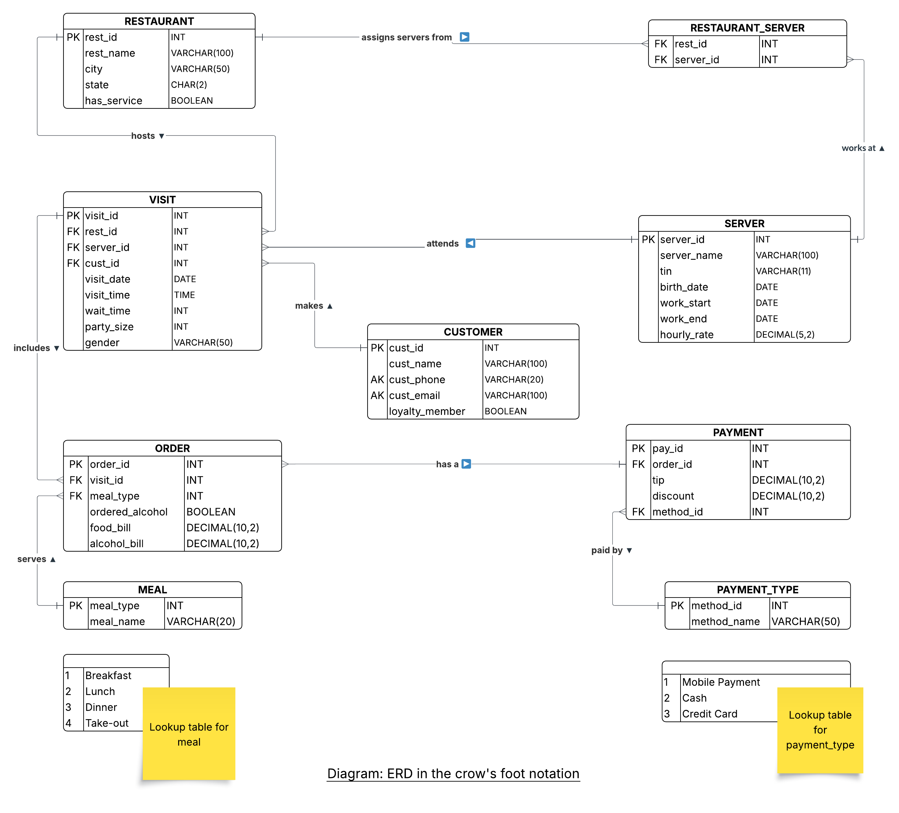

```{r setup, include=FALSE}
knitr::opts_chunk$set(echo = FALSE)
```

# Question 1: Functional Dependencies

### Schema of Unnormalized Relation

The original unnormalized relation contains the following **attributes**:

From CSV file:
 Restaurant,
 ServerEmpID,  
 ServerName,
 ServerBirthDate,
 StartDateHired,
 EndDateHired,
 HourlyRate,
 ServerTIN,
 CustomerName,
 CustomerPhone,
 CustomerEmail,
 LoyaltyMember,
 VisitDate,
 VisitTime,
 WaitTime,
 PartySize,
 Genders,
 MealType,
 orderedAlcohol,
 FoodBill,
 AlcoholBill,
 PaymentMethod,
 TipAmount,
 DiscountApplied

From SQLite database (restaurants table):
 rname,
 city,
 state,
 hasService

## Functional Dependencies in Unnormalized Relation

### Primary Functional Dependencies

#### Restaurant-Related Dependencies
$\text{Restaurant} \rightarrow \text{city, state, hasService}$

This dependency exists because restaurant information comes from the SQLite database where restaurant name determines location and service availability.

#### Server-Related Dependencies
$\text{ServerEmpID} \rightarrow \text{ServerName, ServerBirthDate, StartDateHired,
\\ EndDateHired, HourlyRate, ServerTIN}$

Each server employee ID uniquely determines all server personal and employment information.

#### Customer-Related Dependencies
$\{\text{CustomerPhone, CustomerEmail}\} \rightarrow \text{CustomerName, LoyaltyMember}$

The combination of phone and email uniquely identifies a customer. Note that either alone may not be sufficient as customers may share phones or emails.

**Alternative Candidate Key:**
$\text{CustomerEmail} \rightarrow \text{CustomerName, CustomerPhone, LoyaltyMember}$

In practice, email alone may uniquely identify customers, but we use the composite key for safety.

#### Visit Transaction Dependencies

The primary key of the unnormalized relation is a composite key:

$\{\text{Restaurant, VisitDate, VisitTime, ServerEmpID}\} \rightarrow \text{all other attributes}$

This composite key uniquely identifies each visit transaction. From this key, we can determine:

$\{\text{Restaurant, VisitDate, VisitTime, ServerEmpID}\} \rightarrow \text{CustomerName, CustomerPhone, CustomerEmail, \\ 
LoyaltyMember, WaitTime, PartySize, Genders, MealType, orderedAlcohol,\\ FoodBill, AlcoholBill, PaymentMethod, TipAmount, DiscountApplied}$

### Partial Dependencies (2NF Violations)

The following partial dependencies exist because non-key attributes depend on only part of the composite primary key:

$\text{Restaurant} \rightarrow \text{city, state, hasService}$

These attributes depend only on Restaurant, not the entire composite key.

$\text{ServerEmpID} \rightarrow \text{ServerName, ServerBirthDate, StartDateHired, EndDateHired, HourlyRate, ServerTIN}$

These attributes depend only on ServerEmpID, not the entire composite key.

$\{\text{CustomerPhone, CustomerEmail}\} \rightarrow \text{CustomerName, LoyaltyMember}$

These attributes depend on customer identifiers that appear in the composite key indirectly through the visit.

 These partial dependencies violate Second Normal Form (2NF) and must be eliminated through decomposition.

### Transitive Dependencies (3NF Violations)

If we introduce surrogate keys to eliminate partial dependencies, transitive dependencies emerge:

$\text{visit\_id} \rightarrow \text{Restaurant} \rightarrow \text{city, state, hasService}$

$\text{visit\_id} \rightarrow \text{ServerEmpID} \rightarrow \text{ServerName, ServerBirthDate, ...}$

$\text{visit\_id} \rightarrow \text{CustomerEmail} \rightarrow \text{CustomerName, CustomerPhone, LoyaltyMember}$

$\text{visit\_id} \rightarrow \text{MealType} \rightarrow \text{meal\_description}$ (if meal descriptions existed)

$\text{visit\_id} \rightarrow \text{PaymentMethod} \rightarrow \text{method\_description}$ (if payment descriptions existed)

These transitive dependencies violate Third Normal Form (3NF) and require further decomposition.

### Multi-Valued Dependencies

$\text{Restaurant} \twoheadrightarrow \text{ServerEmpID}$

This multi-valued dependency indicates that:
- One restaurant employs multiple servers (independent of specific visits)
- One server can work at multiple restaurants (independent of specific visits)
- This is a many-to-many relationship requiring a bridge table

## Summary of Normalization Issues

1. **Not in 1NF:** The Genders attribute contains multiple character values (e.g., "mfmf") representing gender composition, which should be atomic
2. **Not in 2NF:** Partial dependencies exist on the composite primary key
3. **Not in 3NF:** Transitive dependencies exist through intermediate keys

# Question 2: Decompostion to 3NF

## Step 1: Achieve First Normal Form (1NF)

### Problem: Non-Atomic Gender Attribute

The Genders attribute in the CSV contains strings like "mfmf" represnting multpile individual genders in a party, violating 1NF's requirement for atomic values.

### Solution: Categorize Gender Composition

Instead of storing individual genders, we categorize the overall party composition:
- 'all_male' - all party members are male
- 'all_female' - all party members are female  
- 'mixed' - party contains both male and female members
- 'unknown' - gender composition unknown or not specified

### Transformation Rule
```
IF all characters in Genders are 'm' THEN 'all_male'
ELSE IF all characters in Genders are 'f' THEN 'all_female'
ELSE IF Genders contains both 'm' and 'f' THEN 'mixed'
ELSE 'unknown'
```

### Result

The Genders attribute is replaced with a single atomic value gender_category, achieving 1NF.

## Step 2: Eliminate Partial Dependencies (Achieve 2NF)

### Step 2a: Extract RESTAURANT Entity

**Violation Identified:**
$\text{Restaurant} \rightarrow \text{city, state, hasService}$

This is a partial dependency because these attributes depend only on Restaurant, not the complete primary key.

**Decomposition:**

**Extract:** 
```
RESTAURANT(rest_id, rest_name, city, state, has_service)
```

**Functional Dependency:**
$\text{rest\_id} \rightarrow \text{rest\_name, city, state, has\_service}$

**Primary Key:** rest_id (surrogate key, auto-increment)

**Attributes:**
- rest_id: INT, PRIMARY KEY, AUTO_INCREMENT
- rest_name: VARCHAR(100), NOT NULL, UNIQUE
- city: VARCHAR(50), NOT NULL
- state: CHAR(2), NOT NULL
- has_service: BOOLEAN, DEFAULT TRUE

**Remaining in Original Relation:**
Replace Restaurant, city, state, hasService with rest_id (foreign key)

**2NF Verification:** All non-key attributes depend on the entire primary key (rest_id alone)

**3NF Verification:** No transitive dependencies exist (all attributes depend directly on rest_id)

---

### Step 2b: Extract SERVER Entity

**Violation Identified:**
$\text{ServerEmpID} \rightarrow \text{ServerName, ServerBirthDate, StartDateHired, EndDateHired, HourlyRate, ServerTIN}$

This is a partial dependency because server attributes depend only on ServerEmpID, not the complete visit key.

**Decomposition:**

**Extract:**
```
SERVER(server_id, server_name, tin, birth_date, work_start, work_end, hourly_rate)
```

**Functional Dependency:**
$\text{server\_id} \rightarrow \text{server\_name, tin, birth\_date, work\_start, work\_end, hourly\_rate}$

**Primary Key:** server_id (surrogate key, auto-increment)

**Attributes:**
- server_id: INT, PRIMARY KEY, AUTO_INCREMENT
- server_name: VARCHAR(100), NOT NULL
- tin: VARCHAR(11), NULL (tax identification number, may be unknown)
- birth_date: DATE, NULL (may be unknown)
- work_start: DATE, NOT NULL
- work_end: DATE, NULL (NULL indicates currently employed)
- hourly_rate: DECIMAL(5,2), NOT NULL

**Remaining in Original Relation:**
Replace ServerEmpID, ServerName, ServerBirthDate, StartDateHired, EndDateHired, HourlyRate, ServerTIN with server_id (foreign key)

**2NF Verification:** All non-key attributes depend on the entire primary key (server_id alone)

**3NF Verification:** No transitive dependencies exist

---

### Step 2c: Extract CUSTOMER Entity

**Violation Identified:**
$\{\text{CustomerPhone, CustomerEmail}\} \rightarrow \text{CustomerName, LoyaltyMember}$

Customer attributes depend only on customer identifiers, not the visit transaction key.

**Decomposition:**

**Extract:**
```
CUSTOMER(cust_id, cust_name, cust_phone, cust_email, loyalty_member)
```

**Functional Dependency:**
$\text{cust\_id} \rightarrow \text{cust\_name, cust\_phone, cust\_email, loyalty\_member}$

**Primary Key:** cust_id (surrogate key, auto-increment)

**Alternate Key:** {cust_phone, cust_email} (composite unique constraint)

**Attributes:**
- cust_id: INT, PRIMARY KEY, AUTO_INCREMENT
- cust_name: VARCHAR(100), NULL (anonymous customers allowed)
- cust_phone: VARCHAR(20), NULL
- cust_email: VARCHAR(100), NULL
- loyalty_member: BOOLEAN, DEFAULT FALSE

**Constraint:** At least one of cust_name, cust_phone, or cust_email must be non-NULL to identify the customer

**Remaining in Original Relation:**
Replace CustomerName, CustomerPhone, CustomerEmail, LoyaltyMember with cust_id (foreign key)

**2NF Verification:** All non-key attributes depend on the entire primary key (cust_id alone)

**3NF Verification:** No transitive dependencies exist

---

### Step 2d: Create VISIT Entity

After extracting restaurant, server, and customer entities, the remaining attributes form the core visit transaction:

**Extract:**
```
VISIT(visit_id, rest_id, server_id, cust_id, visit_date, visit_time, 
      wait_time, party_size, gender)
```

**Functional Dependency:**
$\text{visit\_id} \rightarrow \text{rest\_id, server\_id, cust\_id, visit\_date, visit\_time, wait\_time, party\_size, gender}$

**Primary Key:** visit_id (surrogate key, auto-increment)

**Foreign Keys:** rest_id, server_id, cust_id

**Attributes:**
- visit_id: INT, PRIMARY KEY, AUTO_INCREMENT
- rest_id: INT, NOT NULL, FOREIGN KEY REFERENCES RESTAURANT(rest_id)
- server_id: INT, NULL, FOREIGN KEY REFERENCES SERVER(server_id)
- cust_id: INT, NULL, FOREIGN KEY REFERENCES CUSTOMER(cust_id)
- visit_date: DATE, NOT NULL
- visit_time: TIME, NULL
- wait_time: INT, DEFAULT 0, CHECK (wait_time >= 0)
- party_size: INT, NOT NULL, DEFAULT 1, CHECK (party_size > 0)
- gender: VARCHAR(20), DEFAULT 'unknown', CHECK (gender IN ('all_male', 'all_female', 'mixed', 'unknown'))

**2NF Verification:** All non-key attributes depend on the entire primary key (visit_id alone)

**3NF Verification:** No transitive dependencies - rest_id, server_id, and cust_id are foreign keys, not determinants of other attributes

---

## Step 3: Resolve Multi-Valued Dependency (Restaurant-Server Relationship)

**Problem Identified:**
$\text{Restaurant} \twoheadrightarrow \text{ServerEmpID}$

Servers work at multiple restaurants independently of any specific visit. This many-to-many relationship creates redundancy if stored in the VISIT table.

**Solution: Create Bridge Table**

**Extract:**
```
RESTAURANT_SERVER(rest_id, server_id)
```

**Primary Key:** {rest_id, server_id} (composite primary key)

**Foreign Keys:** 
- rest_id REFERENCES RESTAURANT(rest_id)
- server_id REFERENCES SERVER(server_id)

**Attributes:**
- rest_id: INT, NOT NULL, FOREIGN KEY
- server_id: INT, NOT NULL, FOREIGN KEY
- PRIMARY KEY (rest_id, server_id)

**Purpose:** This associative entity resolves the many-to-many relationship by storing which servers are authorized to work at which restaurants, independent of actual visit records.

**Verification:** This is a pure bridge table with no non-key attributes, automatically satisfying all normal forms

---

## Step 4: Further Decompose Visit Data (Achieve 3NF)

The visit transaction contains order and payment information that should be separated to achieve better normalization and support multiple orders per visit if needed in the future.

### Step 4a: Extract ORDER Entity

**Reasoning:**
Order details (meal type, food/alcohol bills) are logically distinct from visit details (date, time, wait time). Separating them allows:
- Multiple orders per visit (e.g., separate lunch and dinner)
- Cleaner data model with focused entities

**Extract:**
```
ORDER(order_id, visit_id, meal_type, ordered_alcohol, food_bill, alcohol_bill)
```

**Functional Dependency:**
$\text{order\_id} \rightarrow \text{visit\_id, meal\_type, ordered\_alcohol, food\_bill, alcohol\_bill}$

**Primary Key:** order_id (surrogate key, auto-increment)

**Foreign Keys:** 
- visit_id REFERENCES VISIT(visit_id)
- meal_type REFERENCES MEAL(meal_type)

**Attributes:**
- order_id: INT, PRIMARY KEY, AUTO_INCREMENT
- visit_id: INT, NOT NULL, FOREIGN KEY
- meal_type: INT, NOT NULL, FOREIGN KEY
- ordered_alcohol: BOOLEAN, DEFAULT FALSE
- food_bill: DECIMAL(10,2), NOT NULL, DEFAULT 0.00, CHECK (food_bill >= 0)
- alcohol_bill: DECIMAL(10,2), NOT NULL, DEFAULT 0.00, CHECK (alcohol_bill >= 0)

**Constraint:** IF ordered_alcohol = FALSE THEN alcohol_bill = 0.00

**3NF Verification:** All attributes depend directly on order_id. The meal_type is a foreign key, not a determinant of other attributes in this table.

---

### Step 4b: Create MEAL Lookup Table

**Problem:** MealType values ('Breakfast', 'Lunch', 'Dinner', 'Take-Out') are repeated strings, wasting space and risking inconsistency.

**Solution: Create Lookup Table**

**Extract:**
```
MEAL(meal_type, meal_name)
```

**Functional Dependency:**
$\text{meal\_type} \rightarrow \text{meal\_name}$

**Primary Key:** meal_type (surrogate key, auto-increment)

**Attributes:**
- meal_type: INT, PRIMARY KEY, AUTO_INCREMENT
- meal_name: VARCHAR(20), NOT NULL, UNIQUE

**Data Values:**
```
1 | 'Breakfast'
2 | 'Lunch'
3 | 'Dinner'
4 | 'Take-Out'
```

**3NF Verification:** Simple lookup table with direct dependency

---

### Step 4c: Extract PAYMENT Entity

**Reasoning:**
Payment details (method, tip, discount) are logically distinct from order details. Separating them provides:
- Cleaner separation of concerns
- Easier to add payment features later (e.g., split payments)

**Extract:**
```
PAYMENT(pay_id, order_id, method_id, tip, discount)
```

**Functional Dependency:**
$\text{pay\_id} \rightarrow \text{order\_id, method\_id, tip, discount}$

**Primary Key:** pay_id (surrogate key, auto-increment)

**Foreign Keys:**
- order_id REFERENCES ORDER(order_id)
- method_id REFERENCES PAYMENT_TYPE(method_id)

**Attributes:**
- pay_id: INT, PRIMARY KEY, AUTO_INCREMENT
- order_id: INT, NOT NULL, UNIQUE, FOREIGN KEY
- method_id: INT, NOT NULL, FOREIGN KEY
- tip: DECIMAL(10,2), NOT NULL, DEFAULT 0.00, CHECK (tip >= 0)
- discount: DECIMAL(10,2), NOT NULL, DEFAULT 0.00, CHECK (discount >= 0 AND discount <= 1)

**Note:** order_id is UNIQUE, enforcing one-to-one relationship between ORDER and PAYMENT

**3NF Verification:** All attributes depend directly on pay_id. The method_id is a foreign key, not a determinant.

---

### Step 4d: Create PAYMENT_TYPE Lookup Table

**Problem:** PaymentMethod values ('Mobile Payment', 'Cash', 'Credit Card') are repeated strings.

**Solution: Create Lookup Table**

**Extract:**
```
PAYMENT_TYPE(method_id, method_name)
```

**Functional Dependency:**
$\text{method\_id} \rightarrow \text{method\_name}$

**Primary Key:** method_id (surrogate key, auto-increment)

**Attributes:**
- method_id: INT, PRIMARY KEY, AUTO_INCREMENT
- method_name: VARCHAR(50), NOT NULL, UNIQUE

**Data Values:**
```
1 | 'Mobile Payment'
2 | 'Cash'
3 | 'Credit Card'
```

**3NF Verification:** Simple lookup table with direct dependency

---

## Final Normalized Schema

After complete decomposition, the normalized database consists of nine relations:

### Core Entity Tables
1. **RESTAURANT** - Restaurant locations and service information
2. **SERVER** - Server employee information
3. **CUSTOMER** - Customer identification and loyalty status
4. **VISIT** - Visit transaction records linking restaurants, servers, and customers

### Junction Table
5. **RESTAURANT_SERVER** - Bridge table resolving many-to-many restaurant-server relationship

### Transaction Detail Tables
6. **ORDER** - Order details for each visit
7. **PAYMENT** - Payment details for each order

### Lookup Tables
8. **MEAL** - Meal type categories (Breakfast, Lunch, Dinner, Take-Out)
9. **PAYMENT_TYPE** - Payment method categories (Mobile Payment, Cash, Credit Card)

## Comfirming how normalistion to 3NF is now satisfied

### First Normal Form (1NF)
- All relations have atomic values
- No repeating groups exist
- Gender composition stored as single categorical value
- Each relation has a primary key
- All attributes contain single values of consistent type

### Second Normal Form (2NF)
- All relations are in 1NF
- No partial dependencies exist
- All non-key attributes depend on the **entire** primary key
- In RESTAURANT_SERVER (composite key), both components are necessary for uniqueness

### Third Normal Form (3NF)
- All relations are in 2NF
- No transitive dependencies exist
- All non-key attributes depend **directly** on the primary key
- Transitive dependencies eliminated through decomposition:
  - Restaurant details: visit_id → rest_id → {rest_name, city, state, has_service} 
  - Server details: visit_id → server_id → {server_name, ...} 
  - Customer details: visit_id → cust_id → {cust_name, ...}
  - Meal names: order_id → meal_type → meal_name 
  - Payment methods: pay_id → method_id → method_name

\newpage

# Question 3: Entity-Relationship Diagram in Crow's Foot Notation

Diagram after normalisation, obtained from step 2.

```{r erd-diagram, echo=FALSE, out.width="100%", fig.align="center"}

```

\newpage

## Entity Descriptions

### RESTAURANT
**Purpose:** Stores information about restaurant locations operated by the management group

**Rules:**
- Each restaurant has a unique name
- Restaurants are identified by location (city, state)
- has_service indicates whether table service is available (vs. counter service only)

---

### SERVER
**Purpose:** Stores employee information for servers who work at the restaurants

**Rules:**
- Servers are identified by a unique employee ID
- Servers may work at multiple restaurants (see RESTAURANT_SERVER)
- work_end is NULL for currently employed servers
- TIN (Tax Identification Number) may be NULL initially but required for payroll

---

### RESTAURANT_SERVER
**Purpose:** Resolves the many-to-many relationship between restaurants and servers

**Rules:**
- Tracks which servers are authorized to work at which restaurants
- Independent of actual visit records (servers can be assigned before working any shifts)
- Composite primary key ensures a server-restaurant pair appears only once

---

### CUSTOMER
**Purpose:** Stores customer identification and loyalty program information

**Rules:**
- Customers can be anonymous (all personal info NULL)
- Phone and email combination should be unique when both are present
- loyalty_member indicates enrollment in rewards program

---

### VISIT
**Purpose:** Records individual visit transactions to restaurants

**Rules:**
- Links restaurant, server, and customer for each visit
- server_id can be NULL (for take-out orders with no assigned server)
- cust_id can be NULL (for anonymous customers)
- wait_time is measured in minutes
- party_size must be at least 1
- gender represents party composition: 'all_male', 'all_female', 'mixed', or 'unknown'

---

### MEAL
**Purpose:** Lookup table for meal type categories

**Rules:**
- Fixed set of meal types: Breakfast, Lunch, Dinner, Take-Out
- Used to categorize orders for reporting and analytics

---

### ORDER
**Purpose:** Stores order details for food and beverage purchases during visits

**Rules:**
- Each visit should have at least one order
- ordered_alcohol indicates whether alcoholic beverages were included
- If ordered_alcohol is FALSE, alcohol_bill must be 0.00
- Bills are stored as monetary amounts in dollars

---

### PAYMENT_TYPE
**Purpose:** Lookup table for payment method categories

**Rules:**
- Fixed set of payment methods: Mobile Payment, Cash, Credit Card
- Extensible to add new payment methods as needed

---

### PAYMENT
**Purpose:** Stores payment transaction details for orders

**Rules:**
- Each order has exactly one payment (one-to-one relationship)
- tip is the gratuity amount in dollars
- discount is stored as a decimal (0.00 to 1.00 representing 0% to 100%)
- Discount is applied to the total bill amount

---

## Relationship Descriptions and Cardinalities

### RESTAURANT <-> RESTAURANT_SERVER <-> SERVER
**Relationship Type:** Many-to-Many (resolved through bridge table)

**RESTAURANT to RESTAURANT_SERVER:**
- Cardinality: One-to-Many
- Participation: Optional (a restaurant may have zero servers in the system initially)
- Read as: "One restaurant assigns many servers"

**SERVER to RESTAURANT_SERVER:**
- Cardinality: One-to-Many
- Participation: Optional (a server may not yet be assigned to any restaurant)
- Read as: "One server works at many restaurants"

**Meaning:** Servers can be authorized to work at multiple restaurant locations, and each restaurant employs multiple servers. This relationship is independent of actual work shifts (visits).

---

### RESTAURANT -> VISIT
**Relationship Type:** One-to-Many

**Cardinality:** One restaurant hosts zero or many visits

**Participation:**
- Restaurant: Optional (new restaurants may have no visits yet)
- Visit: Mandatory (every visit must be at exactly one restaurant)

**Notation:** Crow's foot on VISIT side, single line on RESTAURANT side

**Meaning:** Each visit occurs at exactly one restaurant location, but restaurants can host many visits over time.

---

### SERVER -> VISIT
**Relationship Type:** One-to-Many

**Cardinality:** One server attends zero or many visits

**Participation:**
- Server: Optional (servers may have no recorded visits)
- Visit: Optional (take-out orders may have no assigned server)

**Notation:** Crow's foot on VISIT side, dashed line on SERVER side (optional)

**Meaning:** Servers are assigned to dine-in visits to track performance and tips. Take-out orders may not have an assigned server.

---

### CUSTOMER -> VISIT
**Relationship Type:** One-to-Many

**Cardinality:** One customer makes zero or many visits

**Participation:**
- Customer: Optional (customers in database may not have visited yet)
- Visit: Optional (anonymous visits have no identified customer)

**Notation:** Crow's foot on VISIT side, dashed line on CUSTOMER side (optional)

**Meaning:** Identified customers can make multiple visits. Anonymous walk-in customers have NULL cust_id.

---

### VISIT -> ORDER
**Relationship Type:** One-to-Many

**Cardinality:** One visit includes one or many orders

**Participation:**
- Visit: Mandatory (every visit must have at least one order)
- Order: Mandatory (every order must belong to exactly one visit)

**Notation:** Crow's foot on ORDER side, solid line on both sides

**Meaning:** Each visit generates at least one order. In the current data model, visits typically have one order, but the structure supports multiple orders per visit for future extensibility.

---

### MEAL -> ORDER
**Relationship Type:** One-to-Many

**Cardinality:** One meal type is used in many orders

**Participation:**
- Meal: Optional (a meal type may not yet be used in any orders)
- Order: Mandatory (every order must have exactly one meal type)

**Notation:** Crow's foot on ORDER side, solid line on ORDER side only

**Meaning:** Orders are categorized by meal period (Breakfast, Lunch, Dinner, Take-Out) for analytics and reporting.

---

### ORDER -> PAYMENT
**Relationship Type:** One-to-One

**Cardinality:** One order has exactly one payment

**Participation:**
- Order: Mandatory (every order must have exactly one payment)
- Payment: Mandatory (every payment belongs to exactly one order)

**Notation:** Single line on both sides with solid lines

**Meaning:** Each order is paid for exactly once. The one-to-one relationship is enforced by UNIQUE constraint on order_id in PAYMENT table.

---

### PAYMENT_TYPE -> PAYMENT
**Relationship Type:** One-to-Many

**Cardinality:** One payment method is used in many payments

**Participation:**
- Payment_Type: Optional (a payment method may not yet be used)
- Payment: Mandatory (every payment must use exactly one method)

**Notation:** Crow's foot on PAYMENT side, solid line on PAYMENT side only

**Meaning:** Each payment transaction uses one payment method (cash, credit card, or mobile payment).

---

## Normalization Summary

**First Normal Form (1NF):** All attributes are atomic with no repeating groups

**Second Normal Form (2NF):** All partial dependencies have been eliminated

**Third Normal Form (3NF):** All transitive dependencies have been eliminated

The schema is normalized to 3NF.